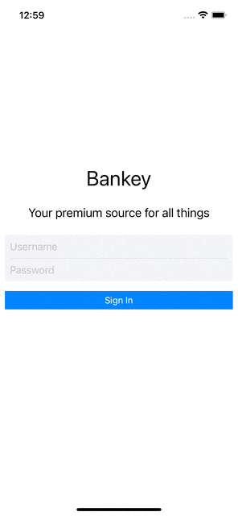

# Bankey App IOS

<div align="center">
  
</div>

<p align="center">
  
 </p>
 
 ## Technologies used 🛠️ 

- Swift
- UIKit
- No Storyboard
- Auto Layout Programmatically
- OOP
- Delegate-Protocol
- Clean Code
 
 
 
 
 ## Clone the repository 🔧

```shell
git clone https://github.com/henriquezani/Calculator-swift-ios.git
```
